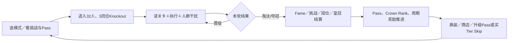

# 《糖豆人》：淘汰赛循环与局外付费机制研究

> 快照日期：2026-07-29
> 研究对象：`Fall Guys` 主游戏；重点为 Knockout/Ranked/Squads 的淘汰循环与局外商业化
> 证据状态：官方规则＋开发者访谈＋完整 B站转写＋知乎全文；未取得内部留存、付费或匹配数据，指标因果均为待验证假设

## 0. 结论先行

《糖豆人》的关键不是“把大逃杀换成闯关综艺”，而是把一次失败拆成短、可解释、可继续积累的多级结果：玩家在一局中不断经历“看懂关卡—在人群与机关中执行—晋级或被淘汰—马上重开”，局外再把到达轮次、挑战完成、段位、皇冠和 Fame Pass 进度转成不同时间尺度的回报。

这套结构在 2020—2026 年经历了四次重要补强：

1. 初版用短关卡、快速失败和滑稽物理降低单次淘汰的挫败，把失败更多归因为“还不熟/场面混乱”，而不是直接输给某一名对手。
2. 小队模式把个人生死改成全队积分：高手不能一人提前结束关卡，弱者也不会一次失误立刻出局；个人名次、掩护、干扰和队友追赶因此同时有价值。
3. 2024 年 Knockout 缩为 32 人、3 回合，官方目标是让胜利更可达、单位时间内可玩的 Show 更多；2025 年 Ranked 又把“越接近决赛越有分”写成八周段位循环，修复“只有冠军才算结果”的过强二元性。
4. 免费化后的商业化没有出售操作能力，而是把局外价值拆为付费 Show-Bucks、免费 Kudos、竞技皇冠/碎片、Fame Pass 和可见外观。当前官方口径为 Pass 花费 600 Show-Bucks、完整进度最多返还 800；它本质上用“先付费—持续游玩—回收下期预算”绑定留存，Tier Skip 则直接出售时间。

最值得迁移的原则是：**淘汰不是终点事件，而是一次结算路由。** 同一场失败要同时回答玩家“为什么输”“离胜利多远”“这次有没有积累”“下一次能否更快/更好”，商业化才有稳定承载面。

## 1. 第一阶段：快速全景扫描

### 1.1 版本演化时间线

| 时间 | 赛制/局外变化 | 对循环的意义 | 证据 |
|---|---|---|---|
| 2020 初版 | 约 60 人、多轮淘汰、最后一人夺冠；买断制，荣耀/皇冠服务外观 | 用短关卡串成完整 Show；冠军价值极高，但早退价值弱 | `FG-ZH-001..003`，历史版本 |
| 2021 小队模式 | 四人队伍以名次积分求和，低分队伍淘汰；一人赢决赛，全队获奖 | 把陪伴、带新、追赶、掩护与干扰纳入胜负 | `FG-BILI-001/S-00001..S-00078` |
| 2022 Free for All | 引入 Show-Bucks；Kudos 不再按每场结算；皇冠不再消费；免费/付费 Pass、挑战和轮换商店 | 货币分层，比赛参与转为 Pass/挑战进度，付费聚焦外观与时间 | [官方经济调整](https://www.fallguys.com/news/upcoming-fall-guys-currency-changes?lang=en-US) |
| 2023 Fame Pass | 一个内容季包含多个连续 Pass；每个约 4—7 周、40 个核心奖励 | 更短商业周期，提高回流与完成压力 | [Creative/Fame Pass 公告](https://www.fallguys.com/news/introducing-fall-guys-creative?lang=en-US) |
| 2024 Fall Forever | Knockout 调为 32 人、3 回合、约 40 张轮换关卡；提高 Knockout 和挑战 Fame | 减少重开成本，提高每小时 Show 数和获胜可达性 | [Fall Forever](https://www.fallguys.com/news/fall-forever-update?lang=en-US) |
| 2025 Ranked Knockout | 八个段位、八周周期；越接近决赛得分越多，高段位早退扣分 | 给中间轮次赋予局外价值；高手获得长期技能目标 | [Ranked Knockout](https://www.fallguys.com/news/fall-guys-ranked-knockout) |
| 2026-04 | Pass 仍为 600 Show-Bucks、最多返 800；美国区 Show-Bucks 价格上调 | Pass 的自续费价值仍在，但直接购币门槛提高 | [2026 价格公告](https://www.fallguys.com/news/price-increases-for-fall-guys-show-bucks-coming-april-8) |

### 1.2 系统地图

| 层 | 系统 | 主要作用 |
|---|---|---|
| 操作层 | 移动、跳跃、飞扑、抓取、碰撞/布娃娃物理 | 易理解动作＋不可完全预测的人群结果 |
| 关卡层 | 竞速、生存、逻辑、团队、决赛、Creator 关卡 | 轮换测试不同技能，控制淘汰率与节奏 |
| Show 层 | Knockout、Duos、Squads、Explore、Ranked、限时模式 | 决定人数、回合数、胜负归属与目标玩家 |
| 结算层 | Fame、挑战、Rank Points、Crowns/Crown Shards | 把参与、阶段成绩、冠军和长期技术分开记账 |
| 成长层 | Fame Pass、Crown Rank、Ranked 周期奖励 | 短期进度、长期威望、周期竞技三条轨道 |
| 商业层 | Show-Bucks、付费 Pass、Tier Skip、轮换商店/联动外观 | 出售外观、收集和时间，不直接出售关卡优势 |
| 内容层 | 关卡池刷新、Creator 内容、活动/联动 | 对抗关卡熟练后的新鲜感衰减 |

### 1.3 公开版本链下的双循环

局内循环生产的是戏剧性、熟练和名次；局外循环把这些结果变成身份展示、阶段目标与付费机会。两者的接口不是“赢没赢”一个布尔值，而是参与、每轮表现、离决赛距离、挑战条件和冠军五组信号。

## 2. 第二阶段：淘汰赛制深拆

### 2.1 为什么失败还能驱动“再来一局”

早期游戏设计师分析指出，完整 Show 时间短、被淘汰后几秒即可重新匹配；滑稽物理和人群碰撞又让玩家容易把失败解释为局面意外或机制不熟，而不是“我绝对打不过对手”。这两个判断来自 2020 版本，具体时长不能直接外推到当前，但它们解释了底层心理结构：

- **低沉没成本**：失败越早，损失时间越少。
- **可学习归因**：关卡先给全景、障碍物可读、动作少，玩家能快速生成“下次改法”。
- **外部归因缓冲**：碰撞和物理意外消解自责，但仍保留足够技巧让练习有意义。
- **结果公开可看**：失败姿态本身有喜剧价值，适合直播和同伴观看。

这不是“随机越多越好”。开发者在「水涨爬高」访谈中给出的目标是混乱与技巧大致各半，并通过可见黏液、弯道视角、容错距离和明确终点把“突然暴毙”改成可预判压力。也就是说，随机负责制造故事，关卡可读性负责让玩家相信自己能进步。

### 2.2 三回合压缩的系统效果

2024 年官方把主 Knockout 改为 32 人、3 回合，公开理由是让胜利对更多玩家可达，并让玩家在相同时间内玩更多局。其潜在连锁效果是：

- 缩短失败到下一次尝试的间隔，提高 `show_start → next_show_start` 周转率。
- 减少连续遇到不喜欢关卡的概率，但也降低一场 Show 的“长征感”。
- 冠军出现频率上升，需要由 Crown Rank、Ranked 和周期奖励重新承接稀缺性。
- 更小关卡池通过定期大幅轮换维持“可掌握但不僵化”的张力。

以上后两项是基于规则的推论，不是官方已经证明的留存因果。

### 2.3 小队模式：把个人淘汰改成团队积分

首席设计师 Joe Walsh 的完整访谈转写给出了非常明确的约束链：

1. 个人失败不应立即把玩家赶出游戏；只有整个小队表现差才淘汰（`S-00001..S-00008`）。
2. 若第一名到线就让全队晋级，新手无法完成赛道，失去“亲自过线”的满足（`S-00045..S-00051`）。
3. 若必须等最后一人，又会变成“全队只等最弱者”，增加责怪与退出压力（`S-00051..S-00053`）。
4. 因此按个人名次给 60 到 1 的积分，以队伍总分淘汰低分队；高手领先、弱者多走一点、队友拖延对手都能产生边际贡献（`S-00054..S-00064`）。
5. 高手带新手进入平常见不到的后期关卡，新手获得练习，再回 Solo 验证学习（`S-00023..S-00030`）。

这是一种很成熟的“异质技能组队”方案：胜负仍是团队的，但体验不是被最强或最弱单点吞掉。它同时扩大了局外循环的社交入口，因为朋友之间技能差距不再必然导致旁观。

### 2.4 Ranked：把淘汰轮次改成连续价值

2025 Ranked Knockout 用“越接近决赛，积分越高”把每次晋级写进局外成长；低四段位不掉大段，高四段位早轮失败会扣分，但最多只降子段。这个结构实现三层保护：

- 新手先学会完成 Show，不因早期失败倒退。
- 中高手开始关心稳定进轮，而不只追求偶发冠军。
- 顶尖玩家通过周期最高段位和独占外观获得身份展示。

八周重置又把永久技能转成周期回流。风险是高段位玩家可能为了积分稳定性规避有趣但高波动的策略，需观察关卡池与分数规则是否压缩玩法多样性。

## 3. 局外付费机制深拆

### 3.1 四种价值必须分开看

| 价值 | 主要载体 | 能否购买 | 设计意义 |
|---|---|---|---|
| 功能/胜率 | 基础动作、关卡资格 | 当前官方材料未见出售 | 维持非 Pay-to-Win 公平预期 |
| 时间 | Fame Pass 进度、Tier Skip | 可购买 Tier Skip | 对完成压力与迟入场玩家变现 |
| 外观/表达 | 服装、颜色、花纹、表情、庆祝动作、联动 | Show-Bucks/Pass/Kudos | 在拥挤赛场、晋级和夺冠镜头中广播身份 |
| 威望/技能 | Crowns、Crown Rank、Ranked 专属奖励 | Crowns/Kudos 官方称不可购买 | 防止付费外观完全吞掉竞技荣誉 |

“外观能在多人赛场被看见，所以更有付费价值”是设计推论；本次没有获得外观曝光到购买的内部转化数据。

### 3.2 货币分层

- **Show-Bucks**：付费货币，用于 Pass 和商店外观；[Epic 跨平台说明](https://www.epicgames.com/help/en-US/c-202300000001638/c-202300000001728/a202300000013884?lang=en-US)显示 Nintendo Switch 购买余额隔离，但用货币购买的内容仍跨平台。
- **Kudos**：免费获得的软货币。2022 免费化时取消每场直接发放，改从活动、挑战和免费进度获取；[当前官方支持页](https://www.epicgames.com/help/c-202300000001638/c-202300000001728/can-i-buy-kudos-or-crowns-in-fall-guys-a202300000016071?lang=en-US)仍称不可购买。
- **Crowns/Crown Shards**：从冠军、部分模式和挑战获得，皇冠不再是消费货币，而是 Crown Rank 和炫耀性进度；同一官方支持页说明 60 碎片合成一皇冠。
- **Fame**：Pass 经验，通过参加/表现、季节挑战和活动推进，不是消费货币。

这种切分让“钱、参与、冠军、长期威望”不再互相兑换，保护了技能奖章。但取消每局 Kudos 也会削弱普通单局与可消费奖励之间的直接联系，因此挑战和 Pass 进度必须及时、清晰地补上反馈。

### 3.3 Fame Pass 的留存—付费闭环

当前官方支持页给出的结构是免费轨＋600 Show-Bucks 升级轨；中途购买可追溯领取已达到等级的奖励，还可购买包含 12 级的 Bundle 或单独 Tier Skip。2026-03 官方又确认完整 Pass 最多产出 800 Show-Bucks。

由此产生四个转化节点：

1. **赛季开始预购**：用首个即时外观和完整高级轨承诺换早期付款。
2. **中途补购**：已完成等级可追溯领取，玩家先证明投入再付款，降低前置风险。
3. **末期 Tier Skip**：用剩余时间压力出售进度。
4. **完成后续购**：600 成本、最多 800 回收，使高完成玩家能继续购买下期，并留下 200 余额作为商店消费种子。

因此 Pass 不只是内容包，更是一份行为合约：价格购买的是“在限定周期内通过游玩把价值取完的资格”。短周期能提高回流频率，也会放大 FOMO、疲劳和任务化游玩的风险。

### 3.4 商店与价格锚点

2022 官方经济公告记录了 Season、Featured、Kudos Items 和 Show-Bucks 分区，以及不同频率轮换；当前具体货架与刷新频率应以实机为准。2026-04 美国区 600 Show-Bucks 精确购买价上调到 8.49 美元，800 包为 8.99 美元，而 Pass 仍为 600。这个邻近价差会把 800 包塑造成更强的默认锚点，但地区价格不同，不能把美国金额外推全球。

付费不影响关卡数值并不等于商业化没有体验风险：高频联动与轮换会占用大厅注意力，Pass 任务会反向选择玩家模式，付费外观若持续强于竞技奖励，也可能削弱皇冠/段位的身份价值。

## 4. 运营与基础设施不是旁支

本地 GDC 2024《Terminal Velocity》提供两条直接影响局外循环的故障证据：

- 客户端在同一 UTC 时间检查商店，制造自发“惊群”，导致商店不可访问；后来通过 jitter 修复（p.39）。商店刷新是商业设计，也是流量调度问题。
- NATS 堵塞导致比赛结束奖励无法处理，支持工单与玩家不满激增；持久队列保证奖励延迟但不丢失（p.42–43）。结算反馈一旦延迟，玩家会认为整场努力没有进入局外循环。

免费化上线前团队按约 300 万并发压测，实际 48 小时达到 2000 万用户，仍出现登录和服务器分配瓶颈（p.49–53）。因此任何“大活动＋新 Pass＋免费回流”设计，都需要把登录、结算、商店分散和补发作为体验验收项。

## 5. 可迁移设计原则

1. **给失败一条可执行解释**：机关可读、目标明确、失败快，玩家才会产生下一局计划。
2. **为中间成绩记账**：到达轮次、个人名次、挑战动作和团队贡献都应能进入不同局外轨道。
3. **组队聚合不能抹掉个人过程**：总分制比“第一人带全队过关”或“等最后一人”更能兼容技能差。
4. **付费外观与竞技威望分轨**：允许购买表达，不允许直接购买冠军含义。
5. **Pass 返币是在购买未来活跃**：应同时评估完成率、疲劳和未完成后的流失，而不只看首购率。
6. **结算与商店属于核心玩法可靠性**：奖励延迟、同刻刷新、登录拥堵都会切断双循环。

## 6. 建议验证指标

| 假设 | 最小指标/实验 | 反证信号 |
|---|---|---|
| 三回合压缩提高重玩 | 各淘汰轮次的 `next_show_start ≤ 60s`、每小时 Show 数 | 单局更多但会话时长/次日留存下降 |
| 中间结果降低冠军二元性 | 到达轮次与下一局率、Ranked 得失分后的退出率 | 非冠军玩家仍在结算页大量退出 |
| 小队总分兼容技能差 | 队内技能差分、完整组队会话率、被淘汰后退队率 | 弱者仍被责怪，高手感到无法影响结果 |
| Pass 返币促进续购 | Pass 完成率、返币后下一 Pass 转化、余额消费 | 完成压力导致赛季末流失或休眠 |
| 竞技威望没有被付费外观稀释 | Crown/Ranked 外观装备率、付费与竞技外观并用率 | 高段位玩家几乎不展示竞技奖励 |
| 商店轮换创造发现而非疲劳 | 曝光→预览→购买、重复曝光、商店打开率 | 打开率下降、只在 Pass 入口消费 |

## 7. 证据账本与边界

| Evidence ID | 主张 | L0 定位 | 层级 | 置信度/边界 |
|---|---|---|---|---|
| FG-E-001 | 快速失败＋可学习归因降低淘汰挫败 | `ZH-article-206778198-P0001..P0003` | L1 | 中；2020 版本、设计师外部分析 |
| FG-E-002 | 小队只在整体表现差时淘汰 | `BV1ov411b7M6-en/S-00001..S-00008` | L1 | 高；首席设计师原话，2021 模式 |
| FG-E-003 | 名次积分解决“最强瞬间带过/最弱拖死”两难 | `S-00045..S-00064` | L1 | 高；ASR 专名需人工校正，逻辑清晰 |
| FG-E-004 | 后期关卡曝光可作为带新与训练 | `S-00023..S-00030` | L1 | 中高；设计意图，不等于实际学习效果 |
| FG-E-005 | 接近决赛也需要碎片等奖励 | `S-00065..S-00078` | L1 | 中高；当时经济尚在定案，后被正式采用 |
| FG-E-006 | 2024 Fall Forever 公告把 Knockout 调为 32 人、3 回合 | Fall Forever 官方公告 | L0/L1 | 高；历史改版事实，2026 当前轮换仍需实机核对 |
| FG-E-007 | Ranked 越接近决赛分越高、八周重置 | Ranked 官方公告 | L0/L1 | 高；2025 规则 |
| FG-E-008 | Pass 600、最多返 800、可 Tier Skip | Epic 支持＋2026 价格公告 | L0/L1 | 高；价格有地区差异 |
| FG-E-009 | 奖励堵塞造成不满，商店同刻检查造成惊群 | GDC 2024 p.39, p.42–43 | L1 | 高；运营故障，不证明商业转化 |

未完成的 L2：当前客户端商店与挑战实机核对、不同水平玩家录像观察、淘汰后重玩率、Pass 完成/续购、付费与竞技外观展示数据。没有这些数据时，本报告给出的是可追溯机制解释和可验证假设，不是收入或留存归因报告。
