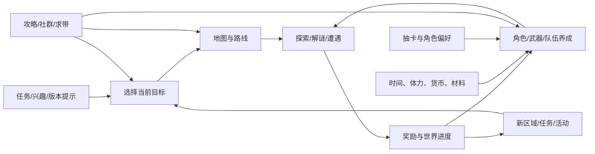

# 0. 一页结论

## 0.1 一句话判断

本批材料支持一个值得实测的假设：**《原神》新手期的关键难点不只是战斗操作，而是在开放探索、任务推进、角色养成、抽卡和长期资源之间判断“现在该做什么、为什么做、做错能否恢复”**。社区攻略能补足知识，但常把专家的信息结构一次性压给新手，容易把“开始探索”改造成“先完成大量概念和效率功课”。

这不是对全部《原神》玩家的统计结论，也不是对游戏内教程的直接评测；它是从 73 条内容、67 条一级评论中形成的深挖假设。

## 0.2 核心体验因果链

```text
自由探索与角色成长的承诺
  ← 选择目标、到达地点、战斗/解谜、领取奖励、改善队伍
  ← 在“推进/探索/养成/抽卡/活动”之间持续分配时间与资源
  ← 地图、任务、世界进度、角色、装备、材料和货币相互耦合
  ← 新手是否能理解“现在重要什么、哪些以后再学、选择是否可恢复”
```

## 0.3 关键发现

| ID | 发现 | 证据 | 置信度 | 对设计判断的影响 |
|---|---|---|---|---|
| F-01 | 至少存在一类“名为萌新攻略、实际按老玩家心智模型组织”的内容；概念多、目的和因果解释少 | E-C01、E-G01、E-G02 | 中 | 研究新手时要统计概念引入顺序，不只检查教程是否存在 |
| F-02 | 部分玩家把世界进度、养成和抽卡选择感知成高风险甚至不可逆，出现“痛苦号、卡等级、重开号”叙事 | E-C02、E-C03 | 低中 | 需要验证真实不可逆成本与感知不可逆成本分别来自哪里 |
| F-03 | 开荒困难可能同时来自目标推理、局外知识、时间投入、局内资源和操作，而不是单一“战斗难” | E-C04、E-C05、E-C06、E-G04 | 低中 | 失败诊断要按挑战成分拆分，避免只调敌人数值 |
| F-04 | 社区中存在能写出条件、例外和机制链的高信息密度材料，但不能靠点赞或资历自述确认正确性 | E-C07、E-C08 | 中 | 高阶玩家来源应要求可复现过程、版本和反例 |
| F-05 | 按账号阶段拆路线、把目标分成“现在/稍后”是可行的社区脚手架 | E-C09、E-G02 | 低中 | 值得做“目标分层卡片”原型，而不是增加更多完整攻略 |

## 0.4 三种结论

- **设计理解：** 新手核心循环不仅是探索和战斗，还包含“目标与资源编排”。当该管理循环失去方向，新手会转向攻略、求带或冻结进度。
- **竞品判断：** 《崩坏：星穹铁道》GDC 案例把表层指令压低、把深度放入组合，并主动降低新内容访问负担；《原神》的开放世界自主性不能直接照搬自动化，但可借鉴“先让玩家开始，再逐层扩展”。
- **方案迁移：** 优先验证信息分层、可逆性提示和分段路线，不建议把“保姆级长攻略”直接做进游戏。
- **最大未知：** 游戏内现有引导是否已经解决这些问题；社区求助可能来自跳过教程、版本差异、个体习惯或攻略本身，而非游戏设计。

# 1. 调研任务书

## 1.1 要支持的决定

建立一套可以复用到 live-service RPG 的调研流程，并判断下一轮玩家观察应优先验证哪一个新手玩法问题。

## 1.2 研究问题

主问题：

> 新手在开放世界开荒中，怎样理解并选择下一目标与下一笔资源投入；哪些信息和系统耦合会让这种选择从“自主探索”变成“害怕做错”？

子问题：

1. 新手核心循环中，战斗、探索、任务和养成怎样互相生成下一目标？
2. 社区攻略在哪些地方补足心智模型，在哪些地方反而增加负荷？
3. 怎样区分高阶玩家的可验证分析与只有影响力的观点？

## 1.3 范围与排除

- 纳入：开局到中前期的目标选择、地图探索、基础战斗/养成、资源投入、外部攻略使用。
- 排除：剧情质量、完整商业化评估、终局数值平衡、具体角色强度、版本内容真假。
- 目标玩家：首次接触或长期离开后回归、尚未形成完整系统心智模型的玩家。
- 证据边界：没有直接游玩、遥测、官方规则核对和一对一观察；只做探索性桌面研究。

## 1.4 可证伪命题

> 在新手尚未建立系统关系图时，如果攻略或游戏同时暴露多个“看似重要且不可逆”的概念，玩家会把注意力从探索/战斗转移到信息筛选、效率焦虑和求助；如果真实新手能在无外部攻略时稳定解释当前目标、选择理由、失败原因和恢复办法，该命题应被削弱。

# 2. 来源、采样与证据边界

## 2.1 社区采样快照

| 平台 | 查询 | 去重内容 | 一级评论 | 本例角色 | 主要限制 |
|---|---|---:|---:|---|---|
| 小红书 | 原神 攻略 | 23 | 23 | 图文清单、探索/培养和具体卡点 | 重复运行后按内容 ID 去重；图片未 OCR |
| B站 | 原神 攻略 | 20 | 20 | 入坑/回坑长视频和较长评论 | 未采字幕与画面 |
| 抖音 | 原神 攻略 | 14 | 14 | 高频问题、短教程、求带和跟路线困难 | 未转写视频；人工登录 |
| 微博 | 原神 攻略 | 16 | 10 | 版本话题、机制速记、路线建议 | 短评论多，空评论重试 |
| 合计 |  | 73 | 67 | 探索性发现 | 单关键词、默认排序、低评论上限 |

详细编码见 [collection-summary.md](collection-summary.md)。

## 2.2 GDC 分析透镜

| 来源 | 本例使用部分 | 能支持什么 | 不能支持什么 |
|---|---|---|---|
| Creating Player Expertise Microtalks（GDC 2026） | p.3-44、48-83 | 认知负荷、重要性×紧迫性教程矩阵、疲劳情境 | 不能证明《原神》的真实新手效果 |
| Flavors of Challenge（GDC 2026） | p.16-44、71-95 | 拆分挑战成分、方向、时间税和动量 | 不能直接给出《原神》的难度结论 |
| Honkai: Star Rail — Reimagining RPGs…（GDC 2025） | p.19-26、50-53 | 同公司相邻 RPG 的简化与扩展案例 | 回合制方案不能直接复制到开放世界即时战斗 |
| The Four One-Page Design Docs…（GDC 2025） | slide 2-20、28-37 | 用 Vision/Pillars/Loops/Resource Flow 组织全景 | 不能代替玩家研究或完整 GDD |

## 2.3 证据规则

- 社区内容证明“某种观点或问题存在”，不证明其总体频率。
- GDC 证明讲者提出过某种方法或项目经验，不证明该方法对本作已生效。
- 下文的玩法全景是 `跨来源综合推论`；未经直接游玩核验的机制细节不标为高置信度事实。
- 高阶玩家候选先看条件、过程、复现、边界和纠错，再看作者资历和互动量。

# 3. 第一阶段：快速全景扫描

## 3.1 游戏快照（待直接游玩核验）

| 项目 | 桌面研究中的暂定描述 |
|---|---|
| 类型 | 开放世界、即时战斗、角色收集与长期养成 RPG |
| 新手主要幻想 | 进入大世界旅行、发现地点与故事、组建喜欢的角色队伍并逐步变强 |
| 主要目标 | 推进任务和世界、探索收集、处理遭遇、培养角色、参与版本内容 |
| 主要压力 | 方向、战斗能力、资源稀缺、时间、版本内容量和选择后果 |
| 成功反馈 | 解锁地点/任务、获得资源、队伍变强、可以进入更多内容 |
| 风险 | 自由目标过多；外部攻略把所有长期系统提前为当前任务 |

## 3.2 体验命题、支柱与反支柱

以下是研究者反推，不是开发者主张：

| 类型 | 暂定内容 | 可观察行为 |
|---|---|---|
| Pillar 1 | 自主旅行与发现 | 玩家因地标、任务或好奇主动偏离路线，并能重新找到方向 |
| Pillar 2 | 角色与元素组合带来的成长 | 玩家改变队伍/养成后能解释战斗结果为何改善 |
| Pillar 3 | 长期世界与内容积累 | 当前目标会生成下一目标，而不是只剩无意义清单 |
| Anti-Pillar | 不应要求新手在开始探索前掌握完整终局优化知识 | 玩家无需先看长攻略才能安全进行前几个小时 |

## 3.3 核心动词

| 动词 | 类型 | 直接反馈 | 主要取舍 | 连接系统 |
|---|---|---|---|---|
| 观察/定位 | 核心 | 地标、地图、任务和敌人信息 | 追主线、偏离探索还是求助 | 地图、任务、世界 |
| 移动/攀爬/传送 | 核心 | 到达与空间进度 | 直达、绕路、收集、体力/时间 | 探索、锚点、地形 |
| 战斗/反应 | 核心 | 伤害、击败、掉落 | 操作、队伍、元素与资源 | 角色、敌人、养成 |
| 收集/领取 | 支撑 | 材料、货币、进度 | 即时奖励与路线偏移 | 世界、活动、养成 |
| 培养/配置 | 管理 | 数值或能力提升 | 投给谁、现在投还是保留 | 角色、武器、材料、货币 |
| 抽取/选择角色 | 管理/表达 | 队伍与角色幻想变化 | 喜好、强度、未来资源 | 货币、卡池、养成 |
| 查攻略/求带 | 外部支撑 | 得到答案或路线 | 自主发现、效率和认知负荷 | 社区、地图、养成 |

## 3.4 三层循环

```text
瞬时（数秒到数十秒）
观察地形/敌人/提示 → 选择移动或战斗动作 → 系统结算 → 反馈 → 新位置/新局势

会话（数分钟到一小时）
选择任务或路线 → 探索/解谜/战斗 → 获得资源与进度 → 培养或解锁 → 选择下一目标

长期（多日到多版本）
投入时间与受限资源 → 建立角色/队伍与地图知识 → 进入更高阶段/新内容
→ 面对新角色、新机制和新目标 → 重新分配资源
```

疑似断点：玩家不知道下一目标、无法解释失败、担心投入不可逆，或必须在游戏与攻略之间频繁切换。

## 3.5 系统关系图



图中的关键耦合不是“系统很多”，而是：**当前目标会决定路线，路线与战斗决定资源，资源投入又决定哪些目标变得容易或困难。** 当玩家不能看见这条因果链时，任何单项建议都可能显得同等紧急。

## 3.6 资源流

| 资源 | 来源/补充 | 消耗/转化 | 制造的取舍 | 本批信号 |
|---|---|---|---|---|
| 时间与注意力 | 一次会话、攻略阅读 | 跑图、剧情、重复、跨屏查路线 | 自主探索 vs. 效率 | E-C06 |
| 地图知识 | 探索、任务、锚点、攻略 | 转化为更快到达和目标选择 | 自己发现 vs. 抄路线 | E-C04、E-C05、E-C09 |
| 角色/装备材料 | 世界、任务、受限活动/系统 | 投入角色与队伍 | 当前战力 vs. 未来选择 | E-C02、E-C03 |
| 抽卡货币 | 探索、任务、活动等 | 角色/装备抽取 | 喜好、强度、储蓄与结果不确定性 | E-C02 |
| 战斗能力 | 操作、知识、队伍与养成 | 解锁更难内容与更快获取 | 玩家技能 vs. 角色数值 | E-C03、E-C04 |
| 信心/账号价值感 | 可解释成功、可恢复失败 | 受阻、抽取落空、错误投入感 | 继续尝试 vs. 求带/退出/重开 | E-C02、E-C03 |

## 3.7 学习、挑战、失败和节奏

用 GDC 2026 的八类挑战做快速诊断：

| 挑战成分 | 新手期可能形式 | 社区信号 | 需要验证 |
|---|---|---|---|
| 推理 | 现在去哪、先养谁、失败原因是什么 | E-C01、E-C04 | 玩家能否说出当前目标和备选方案 |
| 操作 | 移动、攀爬、战斗执行 | E-C04 | 卡点究竟是操作、信息还是数值 |
| 随机 | 抽卡结果等 | E-C02 | 随机结果如何影响继续游玩意愿 |
| 局外资源 | 时间、设备、攻略、先验知识 | E-C06 | 跨屏切换和查资料耗时 |
| 耐力 | 长路线、重复收集、内容追赶 | E-C02、collection-summary | 何时从投入变成时间税 |
| 人际 | 求带、找大佬、评论区纠错 | collection-summary | 帮助是否建立理解还是代替行动 |
| 局内资源 | 队伍、材料、货币、角色能力 | E-C02、E-C03 | 哪些投入真实不可逆，哪些只是感知风险 |
| 表现承受 | 长期内容和复杂世界带来的压迫感 | E-G03 仅作透镜 | 不从社区词频直接推断 |

## 3.8 深挖候选

评分为研究者判断，满分越高越值得先研究：

| 候选 | 核心性 | 差异性 | 不确定性 | 迁移价值 | 证据缺口 | 成本 | 总分 |
|---|---:|---:|---:|---:|---:|---:|---:|
| 新手如何选择下一目标与资源投入 | 5 | 4 | 5 | 5 | 5 | 2 | 22 |
| 外部地图/视频路线怎样影响探索学习 | 4 | 4 | 4 | 4 | 4 | 2 | 18 |
| 高阶配队与元素机制怎样形成专家深度 | 4 | 3 | 3 | 4 | 3 | 4 | 13 |

选定第一个问题。它连接探索、战斗、养成、抽卡和社区，且最可能影响 onboarding 设计。

# 4. 第二阶段：新手目标与资源选择深拆

## 4.1 研究单元

一次复合场景：新手在任务/敌人受阻或获得新资源后，需要决定“继续当前目标、换目标、培养、抽卡、查攻略还是求助”。

反证行为：玩家能在 30 秒内解释当前目标、至少两个选项、选择理由、失败原因和恢复方式，并在不查完整攻略的情况下继续。

## 4.2 综合过程还原

这是多条材料拼出的假设路径，不代表任何单个玩家完整经历：

| 阶段 | 玩家信息 | 玩家问题 | 可选行动 | 反馈/后果 | 证据 |
|---|---|---|---|---|---|
| 触发 | 任务怪打不过、路线受阻、获得抽卡/养成资源 | 是技术、等级、队伍还是路线错了？ | 重试、换目标、升级、查攻略、求带 | 问题尚未被分类 | E-C02、E-C04 |
| 搜索 | 攻略同时出现任务分类、多个等级、体力/树脂、卡池和培养 | 哪些现在必须知道？ | 连续看、跳段、收藏、问评论区 | 重要性与紧迫性混在一起 | E-C01、E-G02 |
| 判断 | 看到“卡等级、避免痛苦号、资源最大化”等建议 | 做错会不会毁号？ | 冻结进度、囤资源、重开、照抄 | 自主目标转成风险规避 | E-C02、E-C03 |
| 执行 | 跟路线或视频操作 | 如何同时看地图和游戏？ | 双设备、分屏、暂停分段 | 慢、乱、注意力切换 | E-C06 |
| 结果 | 获得进度/资源，或仍然失败 | 我学会了规则还是只完成了步骤？ | 继续依赖攻略、求带、放弃 | 可能形成外部脚手架依赖 | E-C05、collection-summary |

## 4.3 认知负荷诊断

套用 GDC 2026 的框架：

| 负荷 | 本例中的暂定解释 | 设计检查 |
|---|---|---|
| 内在负荷 | 开放世界、即时战斗、队伍和长期养成原本就有的必要复杂度 | 当前目标是否真的需要同时理解这些系统？ |
| 无关负荷 | 术语先于目的、攻略跨屏切换、版本信息与当前任务混杂 | 能否减少搜索、记忆和界面跳转？ |
| 促进学习的负荷 | 比较两个可行目标、解释失败原因、尝试队伍/路线并看到结果 | 玩家是否有安全练习和可解释反馈？ |

本例不主张“信息越少越好”。目标是减少与当前决定无关的信息，把空出的注意力用于理解真正的因果。

## 4.4 教程矩阵应用

| 重要性×紧迫性 | 新手信息示例 | 建议方式 | 验证点 |
|---|---|---|---|
| 重要且现在需要 | 移动、交互、当前战斗的一个关键、当前目标 | Do：在场景里立即做一次 | 完成后能否解释为何这样做 |
| 重要但稍后需要 | 资源长期价值、世界进度、元素/队伍结构 | Show：在第一次真实使用前后逐层展示 | 是否只在相关目标出现时引入 |
| 次要但现在相关 | 某个 Boss 的特殊机制、某次路线分叉 | Reinforce：上下文提示和失败复盘 | 提示能否指出原因而非只给答案 |
| 不重要且不紧急 | 终局最优配装、全角色清单、远期版本效率 | Cut/Archive：放进可检索手册，不主动弹出 | 新手是否仍能安全前进 |

## 4.5 决策质量与不可逆感

| 决策 | 真实成本待核 | 玩家可能感知 | 风险 | 研究问题 |
|---|---|---|---|---|
| 升级世界/账号阶段 | 可能改变挑战和奖励 | “突破后大世界无法玩” | 冻结进度或重开 | 是否有预览、恢复和难度校准？ |
| 投入角色/装备 | 消耗材料和时间 | “养错会变痛苦号” | 不敢实验，只抄答案 | 前期投入是否有安全上限或返还？ |
| 使用抽卡货币 | 结果有随机性 | “没抽到目标，之前积累白费” | 情绪性退出 | 目标、概率和保底理解是否清楚？ |
| 选择探索路线 | 消耗时间和注意 | “不跟一条龙就亏” | 自主发现被效率替代 | 游戏能否承认多种合理路线？ |

这里必须把“客观不可逆”与“社区话语制造的不可逆感”分开。下一轮需要官方规则和直接实验核对。

## 4.6 高阶玩家材料怎样使用

本批高阶候选材料的价值不在“结论权威”，而在它们提供了可验证结构：

- E-C07 写出属性转化的条件、例外和具体交互，可转成训练场实验。
- E-C08 把 Boss 攻略拆成元素选择、进度条、分裂、聚怪和禁用方案，可按步骤录像复现。
- E-C09 按玩家等级拆路线，是“把所有信息一次讲完”的反例。

每条仍需检查版本、前置条件、完整录像、失败样本和勘误记录。粉丝数与互动量只用于发现材料，不进入证据强度评分。

## 4.7 系统耦合与下行螺旋

暂定下行路径：

```text
目标不清/遭遇失败
→ 搜索大量攻略
→ 暴露更多长期系统和“不要做错”规则
→ 感知选择不可逆
→ 冻结进度、照抄、求带或重开
→ 自己建立因果模型的机会减少
→ 下一次仍依赖攻略
```

反向恢复路径应是：

```text
识别当前阻塞类型
→ 给出两个可行且可恢复的选择
→ 玩家亲自执行一个最小步骤
→ 反馈解释“为什么有效”
→ 奖励同时给出下一方向
```

# 5. 相邻产品同题对照

共同问题：如何让新玩家愿意开始一个系统丰富、持续更新的 RPG，同时保留长期精通空间？

| 维度 | 《原神》本批社区观察 | 《崩坏：星穹铁道》GDC 2025 开发者主张 |
|---|---|---|
| 表层行为 | 开放世界移动、探索、即时战斗、目标选择 | 有限战斗技能、终结技任意时点、自动战斗 |
| 深度位置 | 路线、元素/队伍、养成、长期资源和开放目标耦合 | 把运行时响应负担前移到编队和角色触发组合 |
| 新手风险 | 自由度与长期系统同时出现时，目标优先级不清 | 先降低开始门槛，再用简单规则组合扩展 |
| 内容债 | 社区大量出现入坑/回坑和版本追赶攻略 | 开发者明确提出更快进入新内容、降低负担 |
| 不可直接复制 | 自动化或强路线可能破坏开放世界的自主探索 | 回合制、线性内容访问与开放世界结构不同 |

可迁移的不是“增加自动战斗”，而是两个原则：

1. 把当前不需要的复杂决定移到更合适的时间点。
2. 让深度来自少数清晰规则的组合，而不是同时展示所有长期系统。

# 6. 综合结论与可迁移方案

## 6.1 因果解释

综合推论（中低置信度）：

1. 开放世界和长期养成提供多条合理目标，这是自由感与长期性的来源。
2. 新手尚未掌握目标、资源和挑战之间的依赖关系时，会把多个选项视为同等紧急。
3. 社区攻略常从“避免浪费”出发，把远期优化提前；它能减少走弯路，也会放大不可逆感。
4. 当失败反馈不能帮助玩家分类问题时，求带、冻结进度和照抄路线成为低风险选择。
5. 因此真正应优化的不是“把所有攻略做进游戏”，而是让玩家逐步建立目标—行动—结果的因果模型。

## 6.2 收益—代价

| 设计选择 | 收益 | 代价 | 对谁有利 | 对谁不利 | 证据 |
|---|---|---|---|---|---|
| 多条开放目标 | 自由、发现、个性路线 | 优先级模糊 | 自驱探索者 | 需要明确短期目标者 | 跨来源推论 |
| 稀缺与长期资源 | 规划、期待和成长价值 | 害怕养错、效率焦虑 | 长期规划者 | 首次接触复杂系统者 | E-C02、E-C03 |
| 完整保姆攻略 | 快速获得答案、减少漏项 | 概念过载、代替理解 | 效率玩家/回坑者 | 尚无术语模型的新手 | E-C01、E-C06 |
| 求带与社群帮助 | 降低即时卡点、建立社交 | 可能绕过学习 | 社交驱动玩家 | 想自主掌握系统者 | collection-summary |

## 6.3 Transfer Card 01：现在/稍后/可查

- 原问题：新手无法区分大量概念的紧迫性。
- 机制：把目标和知识分为“现在做一次”“即将需要”“可随时查”，只在真实场景引入。
- 因果：减少无关记忆，把注意力留给当前因果学习。
- 前置条件：系统能识别玩家阶段和当前阻塞；提示有稳定的归档入口。
- 失效边界：过度收窄会削弱探索自由；高手应能跳过或提前查看。
- 最小原型：把现有新手任务复制成纸面卡片，重排为三层，对 5 名新手测试。
- 通过标准：首 90 分钟未知术语求助下降，且玩家仍主动选择至少一次非主线目标。
- 停止标准：玩家只跟卡片、不再观察世界，或资深玩家被强制阻塞。

## 6.4 Transfer Card 02：安全投入与恢复说明

- 原问题：玩家把早期投入感知为“毁号”。
- 机制：在关键投入前显示影响范围、可恢复方式和“前期安全阈值”；提供低成本重分配或试用空间。
- 因果：降低不可逆恐惧，让玩家愿意实验并从反馈学习。
- 前置条件：必须先核对哪些资源真实稀缺，不能用文案掩盖实际高成本。
- 失效边界：完全无成本会消除长期规划张力。
- 最小原型：为一次角色培养和一次进度升级做结果预览＋恢复路径提示。
- 通过标准：玩家能独立做决定并准确描述最坏后果；“先去查攻略”比例下降。
- 停止标准：提示被理解为官方最优解，或显著降低资源选择的意义。

## 6.5 Transfer Card 03：可学习的路线脚手架

- 原问题：跨屏跟长路线慢、乱，完成了路线却未必学会导航。
- 机制：路线拆成 3—5 个可见地标段；每段先给方向和理由，完成后让玩家自己选下一段。
- 因果：把注意力从记忆完整路径转为识别地标和局部决策。
- 前置条件：地图和地标可读，允许偏离后重新接入。
- 失效边界：纯收集效率用户可能仍偏好完整一条龙。
- 最小原型：将一个公开视频路线重写为分段卡片，与原视频跟跑对照。
- 通过标准：完成时间不显著恶化，跨屏次数下降，结束后能独立返回两个地标。
- 停止标准：分段提示遮挡探索、增加点击或让玩家丢失整体方向。

## 6.6 下一轮验证计划

| 优先级 | 未知 | 方法 | 样本/场景 | 指标 | 通过/反证标准 |
|---|---|---|---|---|---|
| 1 | 概念负荷是否来自游戏还是攻略 | 5 名真实新手首 90 分钟观察；禁攻略 45 分钟后允许查 | 首次账号、不同动作/RPG经验 | 每 10 分钟新术语、求助、停顿、目标解释 | 多数人无需攻略仍能解释目标则削弱主假设 |
| 2 | “毁号”感知对应哪些真实成本 | 官方规则核对＋两个测试账号复现实验 | 角色投入、世界进度、抽卡前后 | 恢复成本、失败变化、玩家预测误差 | 感知风险与真实风险一致则优先改系统而非提示 |
| 3 | 信息分层是否改善自主性 | 当前流程 vs. 三层卡片原型 | 相同早期任务 | 完成率、偏离探索、复述、查攻略次数 | 负荷下降且自主选择不下降才继续 |
| 4 | 分段路线是否教会导航 | 完整视频 vs. 地标分段卡片 | 同类地图路线 | 跨屏次数、耗时、回忆地标、二次独立到达 | 只提速但不提升独立导航则不视为学习改善 |
| 5 | 高阶攻略是否可靠 | 对 E-C07/E-C08 做版本核对和录像复现 | 固定角色/敌人/配置 | 复现成功、例外、修订记录 | 不能复现则降级为观点证据 |

# 7. 当前不能下的结论

- 不能说“大多数《原神》新手都认知过载”。
- 不能说某个平台玩家更专业或更焦虑。
- 不能确认“卡 45”“重开号”等建议在当前版本正确。
- 不能把社区攻略的问题直接归因于游戏内教程。
- 不能据本批结果评价具体角色、版本和卡池。
- 不能确认高阶评论者的真实段位、账号或策划身份。

# 8. 来源与复现

完整来源登记见 [source-register.csv](source-register.csv)，证据边界见 [evidence-ledger.csv](evidence-ledger.csv)。GDC 原文件位于研究工作区，不随仓库提交；社区只登记公开内容 URL，不提交全文、作者个人信息、登录凭证或媒体。

## 完成检查

- [x] 明确了范围、目标玩家和可证伪主问题。
- [x] 第一阶段包含三层循环、系统图和资源流。
- [x] 第二阶段选择一个可观察的复合决策单元。
- [x] 社区、GDC 主张和综合推论分开。
- [x] 核心结论带 Evidence ID、替代解释和置信度。
- [x] 给出相邻产品对照、迁移前置条件和失效边界。
- [x] 给出最小验证、通过标准和反证标准。
- [ ] 仍需直接游玩、官方规则核对和真实新手观察后，才能形成正式设计结论。
