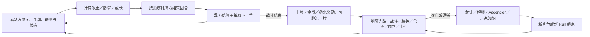

# 《杀戮尖塔》：核心循环、构筑决策与失败承接研究

> 快照日期：2026-07-29
> 研究对象：2019 正式版《Slay the Spire》一代；以 Steam/PC 规则为基准
> 排除：《杀戮尖塔 2》、Mod、移动端商业化、逐卡数值攻略
> 证据状态：开发者/GDC 一手材料＋Steam 规则页＋知乎完整长文；没有本轮直接游玩录像和内部遥测，行为因果仍需 L2 实测

## 0. 结论先行

《杀戮尖塔》的核心不是“抽到强卡”，而是把一次爬塔变成连续修改未来概率分布的过程。玩家每经过一场战斗，既要解决眼前的攻击/防御问题，又要决定是否把一张卡永久加入本局牌组；路线、生命、金币、药水、遗物和营火则共同决定玩家还能用多大代价寻找下一次构筑机会。

这套循环成立依赖四个互锁设计：

1. **敌方意图把未知风险变成可计算问题。** 玩家不知道下一手牌，却知道敌人本回合要做什么，因此能围绕能量、手牌与生命作真实取舍，而不是双边猜盲。
2. **奖励同时也是负债。** 新卡提高某种能力，也稀释未来抽到关键牌的概率；“跳过”使每次奖励成为构筑判断，而非无脑成长。
3. **跨节点资源把战斗连成整局。** 生命通常不会在普通战斗后自动恢复；精英、商店、营火和事件因此都在争夺同一份路线选择权。
4. **跨局主要保留知识，不保留线性数值优势。** 死亡重置本局牌组/遗物/路线，但玩家记住敌人节奏、牌值、协同和风险阈值；Ascension 再把同一套规则逐层加压，形成高手长期目标与数据分层。

与《糖豆人》相比，两者都用“短反馈单元＋可变序列＋失败后快速提出下一问题”制造再来一局；差异在于《糖豆人》把结果接到公开身份、周期进度与付费外观，《杀戮尖塔》把结果接到私人知识、解锁和难度阶梯。前者商业循环是核心外围系统，后者的 Steam 版主要是买断产品，局外循环不需要制造付费入口。

## 1. 第一阶段：快速全景扫描

### 1.1 游戏快照

| 项目 | 内容 | 证据/边界 |
|---|---|---|
| 类型 | 单人 Roguelike Deckbuilder | [Steam 官方页](https://store.steampowered.com/app/646570/Slay_the_Spire/?l=english) |
| 内容结构 | 4 个角色、350+ 卡牌、200+ 物品、50+ 战斗和 50+ 事件 | Steam 当前商品说明；数量是内容规模，不是平衡结论 |
| 局内目标 | 在随机路线中构筑牌组、存活并击败塔顶敌人 | Steam 官方描述 |
| 核心压力 | 当前回合生存 vs 长期构筑；稳定强度 vs 高上限协同；当前收益 vs 路线风险 | `STS-NIN-001`、`STS-ZH-002..004` |
| 失败损失 | 当前 Run 的牌组、遗物、路线与进度重置 | 需本轮实机 L2 核对具体解锁节奏 |
| 长期资产 | 玩家知识、角色/卡牌解锁、Ascension 难度进度、统计/成就 | Ascension 的设计与数据用途见 GDC p.16 |
| 商业形态 | Steam 页面以单次购买本体呈现，另列原声 DLC；未展示 Pass、付费货币或数值售卖 | 只审计 Steam 页面，不能外推所有移植平台 |

### 1.2 三层循环



- **瞬时循环**：读意图 → 看手牌/能量 → 分配攻防与成长 → 敌方行动 → 新手牌。
- **遭遇/单局循环**：选路 → 承担节点风险 → 获得卡牌/遗物/金币/药水 → 改变牌组与剩余生命 → 再选路。
- **跨局循环**：失败/通关 → 复盘敌人、牌值与路线阈值 → 解锁/提升 Ascension → 用新知识进入不同随机局。

### 1.3 系统与资源地图

| 系统/资源 | 局内作用 | 与其他系统的连接 | 形成的主要问题 |
|---|---|---|---|
| 敌方意图 | 公开本回合威胁 | 手牌、能量、生命、状态 | 这一回合应止损、输出还是投资成长？ |
| 能量 | 限制当回合行动预算 | 卡费、抽牌、费用生成、X 费 | 哪些牌值得占用有限行动窗口？ |
| 抽牌堆/弃牌堆/消耗 | 决定未来手牌分布 | 加牌、删牌、过牌、保留 | 当前选卡怎样改变后续抽到关键牌的概率？ |
| 生命 | 跨战斗保留的容错预算 | 精英、营火、事件、遗物 | 还能把多少生命换成长？何时必须恢复？ |
| 路线 | 控制风险与成长机会序列 | 当前强度、未来 Boss、金币 | 追精英上限还是走安全节点保完成率？ |
| 金币/商店 | 提供定向卡、遗物、药水与删牌 | 路线、机会成本 | 现在修补短板还是保留购买力？ |
| 遗物 | 提供跨回合/跨战斗规则变化 | 卡组主题、事件、精英/Boss | 是围绕遗物转型，还是保持牌组弹性？ |
| 药水 | 一次性纠错/爆发 | 精英、Boss、槽位、商店 | 现在止损还是为更危险节点保留？ |
| Ascension | 逐层提高规则压力 | 玩家技能、遥测分层 | 哪些在低难度可行的习惯会在高难度失效？ |

### 1.4 深挖候选与选择

| 候选 | 核心性 | 差异性 | 迁移价值 | 证据充分度 | 决定 |
|---|---:|---:|---:|---:|---|
| 意图—能量—手牌的回合决策 | 5 | 5 | 5 | 5 | 深挖 |
| 路线—生命—构筑的跨节点循环 | 5 | 5 | 5 | 4 | 深挖 |
| Ascension/解锁的跨局成长 | 4 | 4 | 4 | 4 | 作为失败承接分析 |
| 具体职业/流派数值 | 3 | 3 | 3 | 3 | 排除，易陷入版本化攻略 |

## 2. 第二阶段：核心玩法深拆

### 2.1 意图系统：保留一侧随机，公开另一侧约束

开发者 Anthony Giovannetti 在任天堂访谈中回顾：原型最初不显示敌人下一步行动，玩家自己的手牌又随机，双边未知让玩家难以形成策略；先尝试“点击敌人查看详情”仍过重、也不利于直播观众共同思考，最终改成全场可见的图标＋数字意图（`STS-NIN-001`）。

这不是简单“降低难度”，而是重新分配不确定性：

| 仍然未知 | 已经公开 | 因此能做的决策 |
|---|---|---|
| 下一轮手牌顺序、后续节点、奖励 | 本回合敌人动作、当前手牌/能量/状态 | 计算能承受多少伤害、是否投资能力牌、药水是否值得现在使用 |

如果敌方意图也隐藏，防御牌的价值会被迫按最坏情况估计，玩家更容易选择保守通解；公开意图则允许不同回合在攻击、防御、成长之间摆动。这一因果来自开发者迭代说明，仍需要录像观察验证不同熟练度玩家是否真的利用了信息。

### 2.2 单回合逐拍还原

| 阶段 | 玩家看到什么 | 核心问题 | 系统结算/后果 |
|---|---|---|---|
| 触发 | 新手牌、能量、敌方意图、双方状态 | 这是生存回合还是建立引擎的窗口？ | 形成有限行动预算 |
| 感知 | 伤害、格挡、易伤/虚弱、抽牌与费用链 | 如果不处理威胁会损失多少跨节点生命？ | 把卡面数字转为未来风险 |
| 判断 | 本回合所有可行牌序 | 输出、防御、成长、药水之间怎样组合？ | 牌序可能改变费用、抽牌和触发顺序 |
| 选择/执行 | 每出一张牌后的新状态 | 是否继续原计划，还是根据新抽牌修正？ | 能量下降、牌进入弃牌/消耗、状态变化 |
| 敌方结算 | 剩余意图 | 本回合接受的损失是否值得？ | 生命/状态改变并进入下一回合 |
| 战后 | 三选一卡/跳过、金币、药水 | 这份即时奖励会不会降低未来牌组稳定性？ | 永久改变本 Run 的手牌概率与路线能力 |

### 2.3 选卡不是“加战力”，而是修改行动概率

Steam 官方把“选择能彼此配合的卡”列为核心特征；任天堂开发者访谈进一步说明，卡牌出现不会根据玩家已有牌组定向喂给某一套路，开发者希望最优策略是保持弹性（`STS-NIN-002`）。因此一次选卡至少要同时回答：

1. 它能否解决下一批敌人的最低输出、防御或群攻要求？
2. 它是否与现有卡牌/遗物形成短协同链，而不是依赖多个尚未出现的零件？
3. 它加入后会怎样改变每轮抽牌分布、能量曲线和“鬼抽”概率？
4. 这张牌是否只在一个未来假设下有效；若假设失败，能否仍提供基准价值？
5. “不拿”是否比任何一个候选都更强？

知乎《杀戮尖塔简析（下）》把成长拆为攻、防、能量和流转，并讨论辅助牌、触发牌、中介牌构成的协同链（`ZH-article-2023053633072234934-P0001..P0005`）。这是一份完整设计论证，但作者职业与实测依据未核，只作为解释模型；“每种牌应占多少”不当成官方事实。

### 2.4 路线把生命变成风险投资预算

单场战斗若只追求胜利，最保守打法可能成立；但生命跨战斗保留、精英提供高价值遗物、营火在休息与升级间二选一，使玩家必须判断“可接受损失”。A20 攻略样本反复讨论营火、精英、Boss 和路线对牌组短板的检查（`ZH-article-44510104-P0001..P0005`），说明高难玩家不会把路线与战斗割裂。

可把跨节点决策简化为：

```text
节点净价值 ≈ 构筑收益＋未来选择权－预期生命损失－占用的路线机会
```

它不是可直接套用的数值公式，而是检查清单。真正困难之处在于每一项都会随牌组改变：同一精英对高爆发牌组可能是便宜遗物，对慢成长牌组则可能终止整局。路线因此既是内容随机化，也是对玩家“是否理解自己当前牌组”的持续考试。

### 2.5 强组合为何没有被全部削平

GDC 2019 幻灯片把平衡目标写为“每张卡都应有位置，同时避免过度扭曲”（p.7），并强调指标只是证据、不是结论（p.13）。任天堂访谈以“堕落＋枯木树枝”为例：组合很强，但它是单人游戏中的低频高光，团队有意保留（`STS-NIN-003`）。

由此得到的平衡边界是：

- 单卡/组合不能稳定压缩所有选择，否则每局会退化为同一答案。
- 偶发超模可以成为本局故事，只要获取不稳定、前置成本真实、没有破坏长期竞争公平。
- 只看胜率或选取率会把“有趣但困难”“玩家误解”和“真正过强”混在一起；需要分 Ascension、角色、出现条件和玩家技能观察。

### 2.6 Ascension：内容复用、技能目标与数据清洗合一

GDC 幻灯片把 20 级 Ascension 明确称作玩家技能分层（p.16）。它同时完成三件事：

1. 玩家逐级提高压力，能看见自己过去的通解何时失效。
2. 设计团队可以把高手数据与新手数据分开，避免总体平均掩盖高难问题。
3. 同一批敌人、卡牌和路线规则被新约束重新估值，延长系统而非纯内容寿命。

因此“20 个难度”不是简单 20 倍内容；它通过改变容错让同一选择空间反复显露新边界。风险是若某一级只增加数值而没有产生新决策，玩家会感到重复而非精通。

## 3. 失败与局外承接

### 3.1 死亡时真正被保留的东西

| 层 | 保留什么 | 不保留什么 | 体验效果 |
|---|---|---|---|
| 系统账户 | 已解锁角色/卡牌、Ascension 进度、成就/统计（具体节奏待实机核） | 本局牌组、遗物、药水、金币、路线 | 给最初几局明确展开，但不提供无限线性碾压 |
| 玩家知识 | 敌人模式、Boss 检查项、卡牌价值、协同、路线/生命阈值 | 对下一局掉落的控制 | “我下次会做得更好”替代“我下次数值更高” |
| 内容随机 | 新路线、新奖励、新敌人序列 | 上一局的确定答案 | 防止复盘直接变成照抄步骤 |

这解释了失败为何能转成重开：玩家通常能指出一个更早的选择——路线太贪、牌组膨胀、缺少群攻、药水保留过久——但下一局又不能原样重做，只能迁移原则。当前材料没有逐局访谈，不能断言所有玩家都会如此归因；新手也可能只把失败归因于发牌差。

### 3.2 Steam 版商业化的设计含义

Steam 当前页面把本体作为一次购买商品，内容页只列原声 DLC，没有 Fame Pass、付费货币或战力售卖。谨慎结论是：**本研究所审计的 Steam 版核心循环不依赖局外付费进度来承接失败。**

这与《糖豆人》有根本不同：

- 《杀戮尖塔》可以允许玩家长时间停在一场 Run 内，完成感来自理解和通关；没有必要为了商店/Pass 曝光频繁切回大厅。
- 新内容价值主要来自扩大组合空间和可传播的策略讨论，不必为付费外观提供高频公共展示镜头。
- 设计团队仍通过 Early Access 周更、主播观察、社区反馈和本地化获取增长，但那是产品传播/迭代循环，不是消费者的局外付费循环。

移动版、主机版和地区商店未在本次审计，不能把“Steam 页没有”写成“所有版本绝无内购”。

## 4. 与《糖豆人》的同题对照

共同问题：怎样让随机序列中的失败仍产生“下一局值得开始”的理由？

| 维度 | 《糖豆人》 | 《杀戮尖塔》 |
|---|---|---|
| 最小决策单元 | 数秒操作＋障碍/人群反应 | 单回合意图＋手牌/能量计算 |
| 单局结构 | 多轮公开淘汰赛 | 多节点、三幕爬塔 Run |
| 失败单位 | 某轮淘汰；小队可延后个人失败 | 生命归零后整场 Run 结束 |
| 失败归因 | 操作、路线、人群碰撞、队友、物理意外 | 牌序、选卡、路线、资源使用、敌人知识 |
| 中间成绩 | 晋级轮次、队伍分、Rank Points、Fame、挑战 | 存活楼层、解锁/Ascension、玩家知识；本局经济随死亡重置 |
| 长期技能标尺 | Crown Rank、Ranked 周期 | Ascension 1—20、心脏/成就等挑战 |
| 社交可见性 | 强：拥挤赛场、队友、外观、胜利动画 | 弱：单人；通过直播、攻略和战绩外部化 |
| 商业模式 | 免费游玩＋Show-Bucks＋外观＋Pass/Tier Skip | Steam 本体买断；核心循环无 Pass/付费货币 |
| 再来一局驱动力 | 短失败成本＋下一关卡序列＋局外进度 | 新随机局面＋知识修正＋更高难度 |
| 关键保护 | 不卖操作优势；竞技威望与付费外观分轨 | 不用永久数值碾压替代学习；随机供给阻止固定套路 |

可迁移共同原则不是“加入 Roguelike”或“缩短局长”，而是：**失败必须留下一个明确、可执行、但不能原样照抄的下一次计划。**

## 5. 可迁移设计原则与验证

1. **只随机一部分关键变量。** 给玩家公开足够约束形成策略，再用手牌/路线/内容序列保证变化。
2. **让奖励改变未来问题，而非只提高数值。** 新能力也应产生牌组稀释、费用、路线或触发条件成本。
3. **用同一资源连接多个节点。** 生命同时连接战斗、精英、营火和事件，才让局部表现改变路线选择。
4. **保留低频超模故事，压制稳定通解。** 单人 PvE 可以允许高光组合，但不能让每局都能强求同一答案。
5. **难度阶梯也是研究采样层。** 设计数据按技能层分析，不拿全体均值直接调高难平衡。
6. **知识成长需要可诊断失败。** 结算或复盘应帮助玩家定位是即时执行、构筑、路线还是资源管理出错。

| 假设 | 最小验证 | 反证信号 |
|---|---|---|
| 意图公开使随机手牌产生策略而非猜盲 | 新手对照：显示/隐藏意图，记录决策解释和防御冗余 | 显示后仍不能说出为何选牌，或只机械打最高数字 |
| “跳过”能抑制牌组膨胀 | 记录不同熟练度的拿牌率、卡组厚度、关键牌到手回合 | 高手也几乎全拿，跳过没有真实价值 |
| 生命连接路线风险 | 回放精英/营火前后的路线改选与预期损失 | 路线只按固定模板选择，与当前资源无关 |
| Ascension 产生新决策而非纯重复 | 同一玩家跨等级的选卡、路线、药水使用变化 | 只增加耗时/失败率，策略分布不变 |
| 失败主要留下可迁移知识 | 死亡后口述“下局会改什么”，并核对下一局行为 | 玩家只有“运气差”，后续选择未改变 |

## 6. 证据账本与边界

| Evidence ID | 主张 | L0/来源定位 | 层级 | 置信度/限制 |
|---|---|---|---|---|
| STS-E-001 | 游戏核心由动态构筑、变化路线与遗物交互构成 | Steam `About This Game/Features` | L0/L1 | 高；官方规则概述 |
| STS-E-002 | 意图系统由“双边未知难以策略化”迭代而来 | Nintendo 访谈“このゲームの奥深さは”段 | L1 | 高；开发者一手回顾 |
| STS-E-003 | 卡牌出现不按现有构筑定向，目标是保持弹性 | 同访谈卡牌随机段 | L1 | 高；不等于所有随机分布完全均匀 |
| STS-E-004 | 低频强组合在单人 PvE 中可被有意保留 | 同访谈“堕落＋古木树枝”段 | L1 | 高；不能推广为“不需平衡” |
| STS-E-005 | 平衡目标是每张卡有位置、避免过度扭曲；数据只是证据 | `Giovannetti...pdf` p.7, p.13 | L1 | 高；幻灯片缺少完整口述上下文 |
| STS-E-006 | Ascension 同时用于玩家技能分层 | 同 PDF p.16 | L1 | 高；实际各层行为差异尚未重算 |
| STS-E-007 | 高难路线与构筑会围绕精英、营火、Boss 检查项共同规划 | `ZH-article-44510104-P0001..P0005` | L1 | 中；作者自述 A20/碎心且主动勘误，身份未外部核验，部分数值过时 |
| STS-E-008 | 能量与攻防/成长形成单回合机会成本 | `ZH-article-650859964-P0001..P0005` | L1 | 中；外部设计分析，部分统计未复算 |
| STS-E-009 | 构筑可拆为攻、防、能量、流转与协同链 | `ZH-article-2023053633072234934-P0001..P0005` | L1 | 中低；作者依据未知，作为分析框架而非事实 |
| STS-E-010 | 16 系统耦合案例证明局部合理数值也可能组合越界 | `ZH-article-2024767073264444473-P0001..P0004` | L1 | 中；是类《杀戮尖塔》开发复盘，不是原作内部证据 |

未完成的 L2：当前版本直接游玩录像、不同熟练度思考 aloud、死亡后行为迁移、Ascension 分层遥测、Steam 以外平台商业化核对。B站已完成候选发现，但本次未取得《杀戮尖塔》关键视频的官方字幕或高质量全片 ASR，因此没有用标题/简介冒充 L0；开发者/GDC 与知乎全文已足以支撑当前机制解释。
